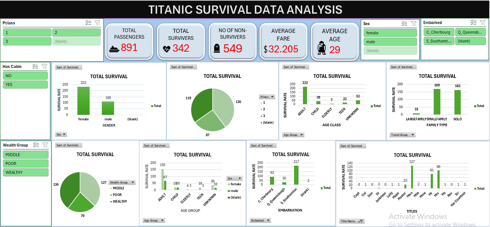
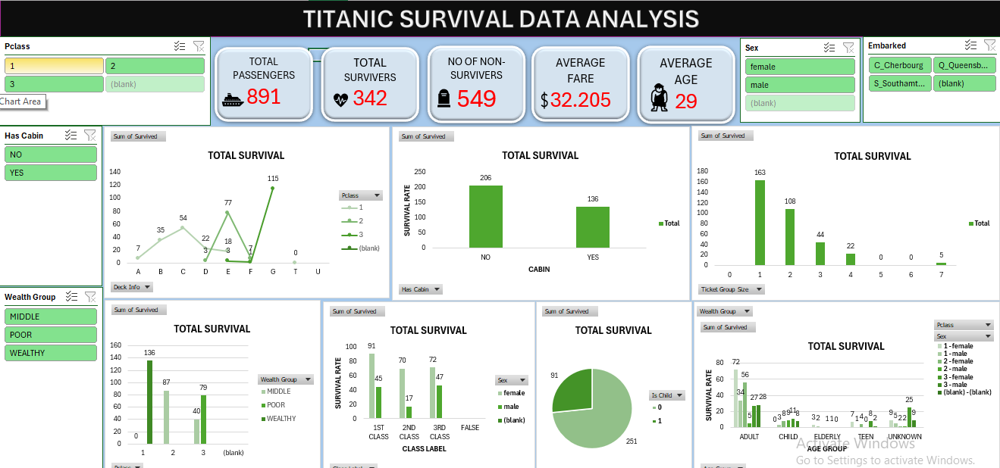

# 🚢 Titanic Data Analysis (Excel Project)

This project explores the Titanic dataset to identify survival trends and key demographic factors influencing passenger outcomes. The analysis was conducted using Microsoft Excel, focusing on data cleaning, visualization, and statistical insights.

## 📊 Project Overview
- Cleaned and formatted raw Titanic data for accurate analysis.
- Analyzed survival rates by **gender**, **age group**, **passenger class**, and **embarkation point**.
- Created Excel dashboards and charts for clear visual insights.
- Highlighted correlations between demographics and survival outcomes.

## 🧠 Key Insights
- Females and higher-class passengers had higher survival chances.
- Younger passengers and those in 1st class showed notable survival advantages.
- Data cleaning improved consistency and eliminated missing/duplicate values.

## 🛠️ Tools Used
- **Microsoft Excel**
  - Data cleaning (filters, text functions, removing duplicates)
  - Data visualization (pivot charts, conditional formatting)
  - Statistical formulas and pivot tables

## 📁 File Included
- `Titanic clean data.xlsx` – Cleaned dataset and analysis workbook.

## 📁 Dashboards screenshots

## 📄 Author
**Mohammed Shoaib Abbas**  
Data Analyst | Excel | Data Visualization  
📧 [Your Email Here] | 🌐 [Your GitHub Profile Link]

---

### ⭐ Highlights
This project demonstrates strong Excel analytics skills, including data preprocessing, pattern recognition, and business reporting.